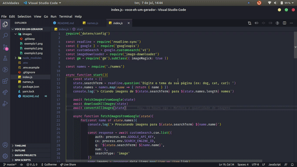

# Você é um gerador

Gerador de fotos de paginas do tipo *"você é um ..."*



## Como funciona?

A ideia é perguntar para o usuário um tipo de foto, pesquisar na API do Google Images, armazenar uma lista de nomes comuns e cruzar esses dados com ferramenta [ImageMagick](https://imagemagick.org/index.php).

A lista de nomes foi retirada do [IBGE](https://censo2010.ibge.gov.br/nomes/#/ranking) e mais alguns foram acrescentados. Atualmente a lista está reduzida para economizar o número de chamadas à API do Google

A busca de imagens é feita com a API Google Custom Search e para fazê-la funcionar é preciso criar um arquivo `.env` na raiz do projeto e fornecer uma `API_KEY`, conforme especificado no modelo `.env.example`.

Para conseguir uma `API_KEY` você pode seguir as intruções [nesse vídeo](https://www.youtube.com/watch?v=LzPuCVhdUew&t=88s), ou acessar diretamente o site do [Google Cloud Plataform](https://cloud.google.com/)

Então basta rodar o projeto com os seguintes comandos:

```bash
npm install
npm start
```

### Alguns resultados


